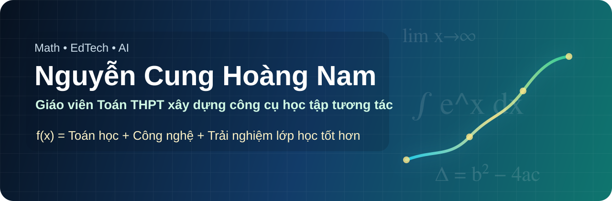

<p align="center">
  
</p>

<p align="center">
  <a href="https://github.com/nguyencunghoangnam">
    
  </a>
  
  
</p>

## Xin chào, tôi là Nguyễn Cung Hoàng Nam

Tôi là giáo viên Toán THPT tại TP.HCM, tập trung xây dựng học liệu số, công cụ tương tác và web app nhỏ giúp việc dạy - học Toán trở nên trực quan, đẹp mắt và dễ dùng ngay trong lớp học.

Tôi thích biến một ý tưởng dạy học thành sản phẩm cụ thể: từ một bài học, một đề kiểm tra, một lớp học thật, rồi phát triển thành công cụ có thể tái sử dụng.

<table>
  <tr>
    <td width="33%">
      <b>Toán học</b><br />
      Bài giảng, đề kiểm tra, minh họa trực quan, hoạt động học tập theo CTGDPT 2018.
    </td>
    <td width="33%">
      <b>EdTech</b><br />
      Web app lớp học, dashboard, công cụ HTML/JS và workflow hỗ trợ giáo viên.
    </td>
    <td width="33%">
      <b>AI trong giáo dục</b><br />
      Tạo học liệu, tự động hóa tác vụ lặp lại và cá nhân hóa trải nghiệm học tập.
    </td>
  </tr>
</table>

## Công nghệ thường dùng

<p>
  
</p>

## Dự án mới nhất

<table>
  <tr>
    <td width="50%" valign="top">
      <h3><a href="https://github.com/nguyencunghoangnam/so-do-lop-10a5">Sơ đồ lớp 10A5</a></h3>
      <p>Công cụ tương tác hỗ trợ giáo viên quan sát, sắp xếp và quản lý sơ đồ lớp.</p>
      <p>
        
        
        
      </p>
    </td>
    <td width="50%" valign="top">
      <h3><a href="https://github.com/nguyencunghoangnam/quan-ly-lop">Quản lý lớp</a></h3>
      <p>Web app quản lý lớp học dành cho thầy Hoàng Nam, hướng tới thao tác nhanh và dễ dùng.</p>
      <p>
        
        
        
      </p>
    </td>
  </tr>
  <tr>
    <td width="50%" valign="top">
      <h3><a href="https://github.com/nguyencunghoangnam/agent-math-tools-demo">Agent Math Tools Demo</a></h3>
      <p>Website công cụ Toán học tự phát triển, vận hành bởi Agent AI.</p>
      <p>
        
        
        
      </p>
    </td>
    <td width="50%" valign="top">
      <h3><a href="https://github.com/nguyencunghoangnam/giai-tich-truc-quan">Giải tích trực quan</a></h3>
      <p>Công cụ giải tích trực quan bằng tiếng Việt, phục vụ minh họa và tương tác trên lớp.</p>
      <p>
        
        
        
      </p>
    </td>
  </tr>
  <tr>
    <td width="50%" valign="top">
      <h3><a href="https://github.com/nguyencunghoangnam/cong-cu-tap-hop-toan-10">Công cụ Tập hợp - Toán 10</a></h3>
      <p>Hai công cụ HTML tương tác hỗ trợ dạy học bài Tập hợp trong chương trình Toán 10.</p>
      <p>
        
        
        
      </p>
    </td>
    <td width="50%" valign="top">
      <h3><a href="https://github.com/nguyencunghoangnam/ki-thi-thu-1004">Kì thi thử 1004</a></h3>
      <p>Đề thi thử Toán mã đề 1004, trình bày dưới dạng học liệu web.</p>
      <p>
        
        
        
      </p>
    </td>
  </tr>
  <tr>
    <td width="50%" valign="top">
      <h3><a href="https://github.com/nguyencunghoangnam/dashboard">Dashboard</a></h3>
      <p>Dashboard phục vụ theo dõi, tổng hợp và quản lý dữ liệu trong công việc dạy học.</p>
      <p>
        
        
        
      </p>
    </td>
    <td width="50%" valign="top">
      <h3><a href="https://github.com/nguyencunghoangnam/nextjs-boilerplate">Next.js Boilerplate</a></h3>
      <p>Khung khởi tạo nhanh cho các ứng dụng web hiện đại bằng Next.js và TypeScript.</p>
      <p>
        
        
        
      </p>
    </td>
  </tr>
  <tr>
    <td width="50%" valign="top">
      <h3><a href="https://github.com/nguyencunghoangnam/nextjs-ai-chatbot">Next.js AI Chatbot</a></h3>
      <p>Dự án chatbot AI trên nền Next.js, định hướng ứng dụng cho học tập và tự động hóa.</p>
      <p>
        
        
        
      </p>
    </td>
    <td width="50%" valign="top">
      <h3><a href="https://github.com/nguyencunghoangnam/congcutoanhoc_12A18_matha">Công cụ Toán học 12A18</a></h3>
      <p>Bộ công cụ Toán học phục vụ lớp 12A18 và các hoạt động học tập tương tác.</p>
      <p>
        
        
        
      </p>
    </td>
  </tr>
</table>

## Cách tôi xây dựng công cụ

```text
Vấn đề thật trong lớp học
        ↓
Ý tưởng Toán học rõ ràng
        ↓
Giao diện dễ dùng cho giáo viên và học sinh
        ↓
Thử nghiệm, điều chỉnh, tái sử dụng
```

<p align="center">
  
</p>

<p align="center">
  <b>f(x) = Toán học + Công nghệ + Trải nghiệm học tập tốt hơn</b>
</p>
